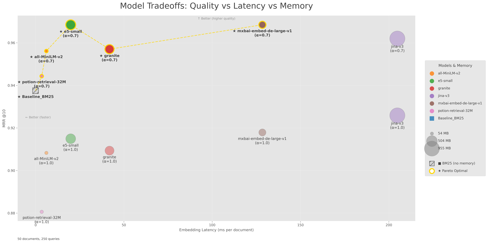

# Hybrid Search Evaluation Tool

**A framework for benchmarking embedding models in hybrid search scenarios (BM25 + vector search) using Weaviate. Measure MRR@K, Hit@K, embedding latency, and memory consumption. Bring your own data or use MTEB-compatible datasets.**


[](https://github.com/machinelearningZH/hybrid-search-eval)
[](https://github.com/machinelearningZH/hybrid-search-eval/stargazers)
[](https://github.com/machinelearningZH/hybrid-search-eval/issues)
[](https://img.shields.io/github/issues-pr/machinelearningZH/hybrid-search-eval)
[](https://github.com/machinelearningZH/hybrid-search-eval)
<a href="https://github.com/astral-sh/ruff"></a>


> [!NOTE]
> The charts above are from a sample evaluation using synthetic data. Actual results will vary based on the dataset and models used. Results do not reflect general performance of the models.

## Key Features

- **Flexible model integration**: Sentence Transformers and OpenRouter embedding models
- **Hybrid search evaluation**: BM25, vector search, and configurable alpha blending
- **Bring your own data**: Support for custom documents
- **LLM-based query generation**: OpenRouter (cloud) or Ollama (local)
- **ColBERT support**: Multi-vector embeddings with MaxSim scoring via [PyLate](https://github.com/lightonai/pylate)
- **MTEB compatible**: Any MTEB 2.x retrieval dataset can be used out of the box
- **Smart caching**: Hash-based caching of embeddings and evaluation results
- **Metrics and visualization**: MRR@K, Hit@K (success rate), embedding latency, and memory consumption charts

This tool complements our existing [semantic search evaluation framework](https://github.com/machinelearningZH/semantic-search-eval).

> [!IMPORTANT]
> Documents are truncated to `max_document_tokens` for embedding (default: 512 tokens, configurable). This affects relevance for documents exceeding this limit, and results will likely differ from benchmarks that use full document text.

> [!CAUTION]
> Sentence Transformers models are loaded with `trust_remote_code=True` by default to support custom architectures. Be aware of potential security implications when using untrusted models.

## Installation

```bash
curl -LsSf https://astral.sh/uv/install.sh | sh # macOS/Linux

# Alternatively, for Windows:
powershell -c "irm https://astral.sh/uv/install.ps1 | more"
# Alternatively, install via pip:
pip install uv

git clone https://github.com/statistikZH/hybrid-search-eval.git
cd hybrid-search-eval
uv sync
```

## Quick Start

```bash
# Start with our synthetic example data
uv run generate_evals.py
# View results in _results/ directory
```

### 1. Bring Your Own Documents & Generate Queries

Start by creating search queries from your documents using an LLM. The tool accepts simple data files and outputs a complete MTEB-format dataset ready for evaluation.

**Input Format:**

Your input file requires a `text` column and optionally an `id` column. Supported formats: `.xlsx`, `.xls`, `.csv`, `.parquet`, `.pq`

**Option A: OpenRouter (Cloud)**

1. Get API key from [openrouter.ai/keys](https://openrouter.ai/keys)
2. Create `.env` file:
   ```bash
   cp .env.example .env
   # Add: OPENROUTER_API_KEY=your-key-here
   ```
3. Generate queries from your documents:

   ```bash
   # From Excel file (outputs to _data/mteb_user/ by default)
   uv run generate_queries.py my_documents.xlsx

   # From CSV with custom output directory
   uv run generate_queries.py docs.csv --output-dir _data/my_dataset

   # From Parquet with 5 queries per document
   uv run generate_queries.py corpus.parquet --num-queries 5
   ```

**Option B: Ollama (Local)**

1. Install Ollama: [ollama.ai](https://ollama.ai)
2. Pull a model (e.g., Llama 3.2):
   ```bash
   ollama pull llama3.2:latest
   ```
3. Generate queries from your documents:

   ```bash
   # From Excel using local Ollama
   uv run generate_queries.py my_documents.xlsx --provider ollama

   # With custom model and output directory
   uv run generate_queries.py docs.csv --provider ollama --model llama3.2:latest --output-dir _data/custom
   ```

**Query Generator Options:**

- `input_file`: Input file with documents (Excel, CSV, or Parquet). Must include a `text` column.
- `--output-dir PATH`: Output directory for MTEB dataset (default: `_data/mteb_user/`)
- `--num-queries N`: Queries per document (default: 10)
- `--model MODEL`: LLM model to use (overrides config)
- `--max-workers N`: Parallel workers (overrides config, default: 25 for OpenRouter, 5 for Ollama)
- `--provider {openrouter,ollama}`: LLM provider (default: openrouter)
- `--config PATH`: Path to config file (default: `_configs/config.yaml`)
- `--ollama-url URL`: Ollama API URL (default: `http://localhost:11434/v1`)

### 2. Configure Data and Models

Edit `_configs/config.yaml`:

```yaml
project_id: "your-project-name"

# MTEB 2.x format
data:
  mteb_data_dir: "./_data/mteb_user" # Directory with corpus.parquet, queries.parquet, qrels.parquet

embeddings:
  huggingface:
    all-MiniLM-v2: sentence-transformers/all-MiniLM-L6-v2
    e5-small:
      model: intfloat/multilingual-e5-small
      use_query_prefix: true # Adds "query: " prefix
      use_passage_prefix: true # Adds "passage: " prefix

  # ColBERT late-interaction models (multi-vector embeddings + MaxSim scoring)
  # These models use token-level embeddings and only support pure semantic search (alpha=1.0)
  colbert:
    mxbai-edge-colbert-32m: mixedbread-ai/mxbai-edge-colbert-v0-32m
    # answerai-colbert-small: answerdotai/answerai-colbert-small-v1
    # GTE-ModernColBERT: lightonai/GTE-ModernColBERT-v1

  openrouter:
    models:
      openai-3-small: openai/text-embedding-3-small # Requires OPENROUTER_API_KEY
    settings:
      api_batch_size: 100

  device: "auto" # "cpu" | "cuda" | "mps" | "auto"
  cache_dir: "./_cache_embeddings"

search:
  alpha: [0.7] # 0.0=pure BM25, 1.0=pure vector
  metrics:
    mrr_k: [10] # Mean Reciprocal Rank @ K
    hit_rate_k: [10] # Hit Rate (Success Rate) @ K
  include_bm25_baseline: true # Include BM25 baseline (pure lexical search)

model:
  embedding_batch_size: 32
  max_document_tokens: 512 # Maximum tokens per document for embedding
```

### 3. Run Evaluation

```bash
uv run generate_evals.py
```

**Options:**

- `--force-recompute`: Regenerate embeddings (bypasses cache)
- `--config PATH`: Custom config file (default: `_configs/config.yaml`)

Results are saved to `_results/` with CSV data and visualizations.

## Using MTEB Datasets

Want to benchmark against established datasets? Download retrieval datasets from the MTEB benchmark directly from Hugging Face.

```bash
# Download full dataset
uv run download_mteb_datasets.py mteb/scifact

# Download only 100 documents (with matching queries/qrels)
uv run download_mteb_datasets.py mteb/scifact --sample 100

# Custom output directory
uv run download_mteb_datasets.py mteb/nfcorpus --output-dir ./_data/custom

# Multilingual datasets (e.g., XMarket with de, en, es)
uv run download_mteb_datasets.py mteb/XMarket --language de
uv run download_mteb_datasets.py mteb/XMarket --language en --sample 1000

# Generate additional queries from existing MTEB corpus
uv run generate_queries.py dummy --mteb-input-dir _data/mteb/scifact --num-queries 5
```

Note: **Documents are truncated to `max_document_tokens` for embedding**, which may affect query relevance scores in MTEB data (qrels) and generally affects query relevance for documents exceeding this limit.

**Options:**

- `dataset_name`: Hugging Face dataset identifier (e.g., `mteb/scifact`, `mteb/nfcorpus`)
- `--output-dir PATH`: Output directory (default: `./_data/mteb`)
- `--sample N`: Download only N documents with corresponding queries/qrels
- `--language LANG`: Language code for multilingual datasets (e.g., `de`, `en`, `es`). Auto-detects available languages and defaults to first if not specified.

**Popular MTEB retrieval datasets:**

- [`mteb/scifact`](https://huggingface.co/datasets/mteb/scifact) - Scientific claims verification / evidence retrieval (5,183 docs)
- [`mteb/nfcorpus`](https://huggingface.co/datasets/mteb/nfcorpus) - Medical / nutrition information retrieval (3,633 docs)
- [`mteb/scidocs`](https://huggingface.co/datasets/mteb/scidocs) - Scientific paper retrieval (25,657 docs)
- [`mteb/fiqa`](https://huggingface.co/datasets/mteb/fiqa) - Financial Q&A retrieval (FiQA-2018) (57,638 docs)
- [`mteb/arguana`](https://huggingface.co/datasets/mteb/arguana) - Counter-argument retrieval (8,674 docs)
- [`mteb/XMarket`](https://huggingface.co/datasets/mteb/XMarket) - Cross-market product search (multilingual: de, en, es; de-corpus: ≈70.5k docs)

**German MTEB retrieval datasets:**

- [`mteb/GermanDPR`](https://huggingface.co/datasets/mteb/GermanDPR) - German dense passage retrieval (Wikipedia-style passages) (≈2.88k docs)
- [`mteb/XMarket`](https://huggingface.co/datasets/mteb/XMarket) - German product search subset (de-corpus: ≈70.5k docs)
- [`mteb/GerDaLIR`](https://huggingface.co/datasets/mteb/GerDaLIR) - German legal case retrieval (≈131k docs)
- [`mteb/LegalQuAD`](https://huggingface.co/datasets/mteb/LegalQuAD) - German legal Q&A retrieval (600 docs)

See more available datasets at: [huggingface.co/mteb](https://huggingface.co/mteb)

**Helper script to list retrieval datasets:**

```bash
uv run list_retrieval_datasets.py
uv run list_retrieval_datasets.py --benchmark "MTEB(eng, v2)"
# Defaults to v2 (and normalizes de -> deu)
uv run list_retrieval_datasets.py --benchmark "MTEB(de)"

uv run list_retrieval_datasets.py --format csv --out retrieval_datasets.csv
```

## Output Visualizations

The evaluation generates the following visualization charts:

1. **MRR (Mean Reciprocal Rank)**: Search quality comparison across models and alpha configurations. MRR measures how high the first relevant document appears in results (1/rank).
2. **Hit Rate (Success Rate)**: Percentage of queries where a relevant document was found in the top-k results. Useful for understanding "was any relevant result found?"
3. **Embedding Latency**: Time taken to generate embeddings for all documents per model.
4. **Memory Consumption**: RAM usage during model loading and embedding generation.
5. **Model Tradeoffs**: Bubble chart showing quality vs latency vs memory tradeoffs. Bubble size indicates memory consumption. [Pareto-optimal](https://en.wikipedia.org/wiki/Pareto_front) models (best tradeoffs) are highlighted with gold edges. BM25 and API models without memory data are shown as squares.



Note: Memory consumption is only tracked for local Hugging Face models, not for OpenRouter API models.

## Data Format

### MTEB 2.x Format

This tool uses the [MTEB 2.x retrieval task specification](https://github.com/embeddings-benchmark/mteb). All files are stored in a single directory (e.g., `_data/mteb_user/`):

**Corpus** (`corpus.parquet`):
| Column | Type | Description |
|--------|------|-------------|
| `id` | string | Unique document identifier (e.g., `doc_0`) |
| `text` | string | Document content |
| `title` | string | Document title (optional, can be empty) |

**Queries** (`queries.parquet`):
| Column | Type | Description |
|--------|------|-------------|
| `id` | string | Unique query identifier (e.g., `query_0`) |
| `text` | string | Query text |

**Relevance Judgments** (`qrels.parquet`):
| Column | Type | Description |
|--------|------|-------------|
| `query-id` | string | Query identifier |
| `corpus-id` | string | Relevant document identifier |
| `score` | int | Relevance score (1 = relevant) |

## Using OpenRouter Embeddings

OpenRouter provides access to commercial embedding models from various providers.

1. Get an API key from [openrouter.ai/keys](https://openrouter.ai/keys)
2. Add to `.env`:
   ```
   OPENROUTER_API_KEY=sk-or-xxxxx
   ```
3. Configure in `config.yaml`:
   ```yaml
   embeddings:
     openrouter:
       models:
         openai-3-small: openai/text-embedding-3-small
         openai-3-large: openai/text-embedding-3-large
         mistral-embed: mistralai/mistral-embed-2312
         gemini-embedding: google/gemini-embedding-001
         qwen3-embedding-4b: qwen/qwen3-embedding-4b
       settings:
         api_batch_size: 100 # Number of texts per API call
   ```

View available embedding models at: [openrouter.ai/models?output_modalities=embeddings](https://openrouter.ai/models?fmt=cards&output_modalities=embeddings)

## Model-Specific Configuration

Models can be configured as either simple strings (using defaults) or dictionaries with custom options.

**Simple models** (use default settings):

```yaml
embeddings:
  huggingface:
    all-MiniLM-v2: sentence-transformers/all-MiniLM-L6-v2
    jina-v2: jinaai/jina-embeddings-v2-base-de
    granite: ibm-granite/granite-embedding-278m-multilingual
```

**Models with instruction prefixes** (e.g. E5 models):

```yaml
embeddings:
  huggingface:
    e5-small:
      model: intfloat/multilingual-e5-small
      use_query_prefix: true # Adds "query: " prefix for queries
      use_passage_prefix: true # Adds "passage: " prefix for documents
```

**Models with encode parameters** (e.g. Snowflake models):

```yaml
embeddings:
  huggingface:
    snowflake-m:
      model: Snowflake/snowflake-arctic-embed-m-v2.0
      use_query_prompt: true # Passes prompt_name="query" to encode()
    snowflake-l:
      model: Snowflake/snowflake-arctic-embed-l-v2.0
      use_query_prompt: true
      use_passage_prompt: true # Passes prompt_name="passage" to encode()
```

**Device configuration:**

```yaml
embeddings:
  device: "auto" # Options: "cpu", "cuda", "mps" (Apple Silicon), "auto"
```

Note: Some models (e.g., minishlab) don't support MPS and automatically fall back to CPU.

## Caching

Embeddings and evaluations are cached in `_cache_embeddings/` and `_cache_evals/`.

**Cache key format:** `{project_id}_{model_short}_{data_type}_{hash[:8]}`

**Note:** Cache does not auto-invalidate when data changes. Use `--force-recompute` to regenerate.

## Additional Notes

- Caches are not automatically invalidated when data changes. Use `--force-recompute` to regenerate embeddings and evaluations.
- ColBERT models use multi-vector embeddings with MaxSim scoring, combined with BM25 using the specified alpha. Weaviate uses the [Relative Score Fusion algorithm](https://docs.weaviate.io/weaviate/api/graphql/search-operators#relative-score-fusion) for combining hybrid rankings. We replicated this algorithm to the best of our ability; however, results may differ slightly.
- **ColBERT evaluation note**: The ColBERT evaluation computes MaxSim scores exhaustively for all query-document pairs, rather than using ANN or first-stage candidate retrieval. This full-corpus scoring approach may overstate practical retrieval performance compared to production systems that use approximate search. Results should be interpreted as an upper bound on ColBERT quality rather than realistic retrieval latency/throughput benchmarks. For hybrid search (alpha between 0 and 1), BM25 candidates are limited by `bm25_candidate_limit` (default: 1000) to avoid performance issues with large corpora.

## Project Structure

- `generate_evals.py`: Main evaluation pipeline
- `generate_queries.py`: LLM-based query generator
- `download_mteb_datasets.py`: Download MTEB datasets from Hugging Face
- `list_retrieval_datasets.py`: List available MTEB retrieval datasets
- `_configs/`: Configuration files
  - `config.yaml`: Default configuration
- `_core/`: Core utilities (`utils.py`, `utils_prompts.py`)
- `_data/`: Data files
  - `mteb/`: MTEB datasets (corpus.parquet, queries.parquet, qrels.parquet)
  - `mteb_user/`: User-generated datasets
- `_cache_embeddings/`: Cached embeddings (_.npy + _.json)
- `_cache_evals/`: Cached evaluation results
- `_results/`: Final CSV results and charts

## Project Team

**Chantal Amrhein**, **Patrick Arnecke** – [Statistisches Amt Zürich: Team Data](https://www.zh.ch/de/direktion-der-justiz-und-des-innern/statistisches-amt/data.html)

## Feedback and Contributing

Feedback and contributions are welcome! [Email us](mailto:datashop@statistik.zh.ch) or open an issue or pull request.

This project uses [`ruff`](https://docs.astral.sh/ruff/) for linting and formatting.

## License

This project is licensed under the MIT License. See the [LICENSE](LICENSE) file for details.

## Disclaimer

This evaluation tool (the Software) evaluates user-defined open-source and closed-source embedding models (the Models). The Software has been developed according to and with the intent to be used under Swiss law. Please be aware that the EU Artificial Intelligence Act (EU AI Act) may, under certain circumstances, be applicable to your use of the Software. You are solely responsible for ensuring that your use of the Software as well as of the underlying Models complies with all applicable local, national and international laws and regulations. By using this Software, you acknowledge and agree (a) that it is your responsibility to assess which laws and regulations, in particular regarding the use of AI technologies, are applicable to your intended use and to comply therewith, and (b) that you will hold us harmless from any action, claims, liability or loss in respect of your use of the Software.
