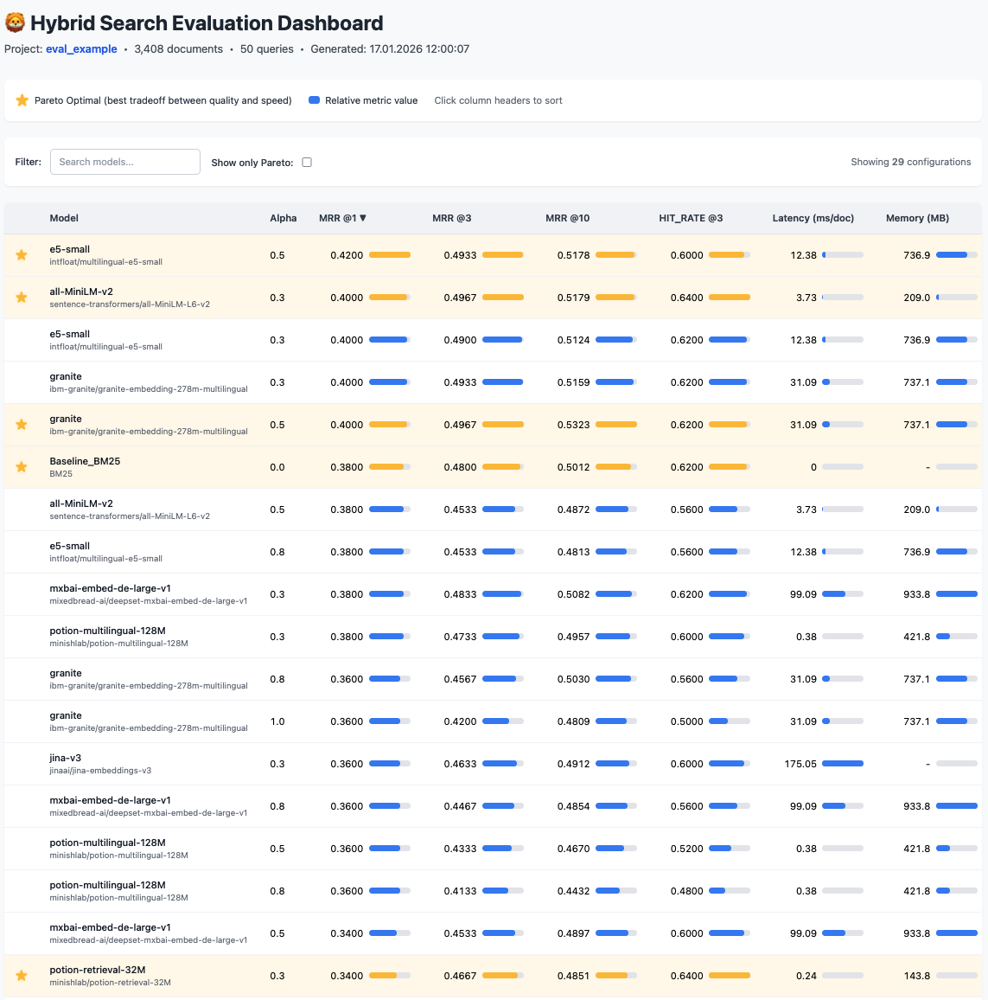

# Hybrid Search Evaluation Tool

Benchmark embedding models for hybrid retrieval with BM25 and vector search. The
tool evaluates local Sentence Transformers, OpenRouter embedding models, and
ColBERT late-interaction models against an [MTEB 2.x](https://github.com/embeddings-benchmark/mteb)
retrieval dataset using Weaviate.

It reports MRR@K, Hit Rate@K, corpus-embedding latency, and a process-memory
estimate for each configured model and alpha value.



## Install

Install [uv](https://docs.astral.sh/uv/getting-started/installation/), then clone
the project and create its environment:

```bash
git clone https://github.com/machinelearningZH/hybrid-search-eval.git
cd hybrid-search-eval
uv sync
```

## Quick start

The repository includes a small MTEB-format example dataset. Review
[`_configs/config.yaml`](_configs/config.yaml), then run:

```bash
uv run generate_evals.py
```

Results are written to `_results/`; embeddings and evaluation results are cached
in `_cache_embeddings/` and `_cache_evals/`.

The main settings are:

```yaml
project_id: "my-evaluation"

data:
  mteb_data_dir: "./_data/mteb_user"

embeddings:
  huggingface:
    all-minilm: sentence-transformers/all-MiniLM-L6-v2
    e5-small:
      model: intfloat/multilingual-e5-small
      use_query_prefix: true
      use_passage_prefix: true
  device: "auto" # cpu, cuda, mps, or auto

search:
  alpha: [0.5, 1.0] # 0.0 = BM25, 1.0 = vector search
  metrics:
    mrr_k: [10]
    hit_rate_k: [10]
  include_bm25_baseline: true

model:
  embedding_batch_size: 32
  max_document_tokens: 512
```

Use a separate configuration with `--config PATH`, and pass
`--force-recompute` after changing the data or a material retrieval or embedding
setting.

## Prepare a dataset

### Generate queries from your documents

`generate_queries.py` accepts CSV or Parquet input with a required `text` column
and an optional `id` column. It creates `corpus.parquet`, `queries.parquet`, and
`qrels.parquet` in MTEB format.

For OpenRouter, create a `.env` file with `OPENROUTER_API_KEY`, then run:

```bash
uv run generate_queries.py my_documents.csv
uv run generate_queries.py corpus.parquet --num-queries 5 --output-dir _data/my_dataset
```

For a local Ollama model:

```bash
ollama pull llama3.2:latest
uv run generate_queries.py my_documents.csv --provider ollama --model llama3.2:latest
```

`--max-workers`, `--model`, and `--ollama-url` override the corresponding
configuration values. To add queries to an existing MTEB corpus, use:

```bash
uv run generate_queries.py ignored --mteb-input-dir _data/mteb/scifact --num-queries 5
```

### Download an MTEB dataset

```bash
uv run download_mteb_datasets.py mteb/scifact
uv run download_mteb_datasets.py mteb/scifact --sample 100 --seed 42
uv run download_mteb_datasets.py mteb/XMarket --language de --split test
```

Downloads are stored in `_data/mteb/` by default and include a
`dataset_manifest.json` with the source revision, selected split/language, and
sampling details. `--sample` uses seeded, query-led sampling and can retain more
than the requested number of documents to preserve positive judgments. Use
`--query-sample` to select an exact number of evaluation queries first.

To inspect available retrieval datasets:

```bash
uv run list_retrieval_datasets.py --benchmark "MTEB(eng, v2)"
uv run list_retrieval_datasets.py --benchmark "MTEB(de)" --format csv --out retrieval_datasets.csv
```

### Required MTEB files

Set `data.mteb_data_dir` to a directory containing these files:

| File | Required columns |
| --- | --- |
| `corpus.parquet` | `id`, `text`; optional `title` |
| `queries.parquet` | `id`, `text` |
| `qrels.parquet` | `query-id`, `corpus-id`, `score` |

## Models and search modes

- Configure Sentence Transformers under `embeddings.huggingface`. A model entry
  can be a model ID or a mapping with `model`, prefix options
  (`use_query_prefix`, `use_passage_prefix`), prompt options
  (`use_query_prompt`, `use_passage_prompt`), or explicit
  `query_prompt_name` / `passage_prompt_name`.
- Configure OpenRouter models under `embeddings.openrouter.models`; they require
  `OPENROUTER_API_KEY` in `.env`. See the
  [available embedding models](https://openrouter.ai/models?fmt=cards&output_modalities=embeddings).
- Configure ColBERT models under `embeddings.colbert`. They use token-level
  MaxSim scores; mixed alpha values combine those scores with BM25.

> [!IMPORTANT]
> Documents are embedded only up to `model.max_document_tokens` (512 by
> default). Their titles are not currently included in indexed text. Results can
> therefore differ from benchmarks that use full document text or model-specific
> tokenizers.

> [!CAUTION]
> Sentence Transformers models are loaded with `trust_remote_code=True` to
> support custom architectures. Evaluate the trustworthiness of every model
> repository before using it.

## Outputs and interpretation

Each run produces CSV results, metric charts, a quality-versus-embedding-latency
trade-off chart, a memory chart, and an interactive HTML dashboard. The dashboard
embeds its result data but loads Tailwind CSS from a CDN, so styled viewing needs
network access.

- **MRR@K** measures the rank of the first relevant result.
- **Hit Rate@K** is the share of queries with at least one relevant result in the
  top K.
- **Latency** is corpus embedding time only; it excludes query embedding,
  indexing, retrieval, reranking, and network transfer.
- **Memory** is a sampled process-RSS delta. It is not a peak measurement and
  excludes accelerator memory.

Treat results as evidence for the configured experiment, not universal model
rankings. In particular:

- LLM-generated queries and qrels primarily test recovery of the source document;
  they can miss other relevant documents and do not represent production traffic.
- MRR and Hit Rate use binary relevance and do not measure recall or graded
  relevance. Preserve per-query results and assess uncertainty before relying on
  small differences.
- ColBERT MaxSim is computed exhaustively across the corpus, so it is a quality
  upper bound rather than a production-throughput measurement. Its score fusion
  is not directly comparable with Weaviate hybrid fusion at the same alpha.
- Cache keys do not include dataset contents, row order, truncation limits, model
  revisions, or every retrieval setting. Recompute after any relevant change and
  compare runs only when their inputs and environment match.
- Query generation saves final Parquet files but not raw responses, provider
  revisions, or a failure manifest. Preserve those separately when auditability
  matters.

## Project structure

| Path | Purpose |
| --- | --- |
| `generate_evals.py` | Evaluation pipeline |
| `generate_queries.py` | LLM query generation |
| `download_mteb_datasets.py` | MTEB dataset download and sampling |
| `list_retrieval_datasets.py` | MTEB retrieval-dataset discovery |
| `_configs/config.yaml` | Default configuration |
| `_data/` | MTEB datasets and user data |

## Contributing

Feedback and contributions are welcome: [email the team](mailto:datashop@statistik.zh.ch),
open an issue, or submit a pull request. The project uses
[Ruff](https://docs.astral.sh/ruff/) for linting and formatting.

## License

This project is licensed under the MIT License. See [LICENSE](LICENSE).

## Disclaimer

This evaluation tool (the Software) evaluates user-defined open-source and
closed-source embedding models (the Models). The Software has been developed
according to and with the intent to be used under Swiss law. Please be aware that
the EU Artificial Intelligence Act (EU AI Act) may, under certain circumstances,
be applicable to your use of the Software. You are solely responsible for
ensuring that your use of the Software as well as of the underlying Models
complies with all applicable local, national and international laws and
regulations. By using this Software, you acknowledge and agree (a) that it is
your responsibility to assess which laws and regulations, in particular regarding
the use of AI technologies, are applicable to your intended use and to comply
therewith, and (b) that you will hold us harmless from any action, claims,
liability or loss in respect of your use of the Software.
