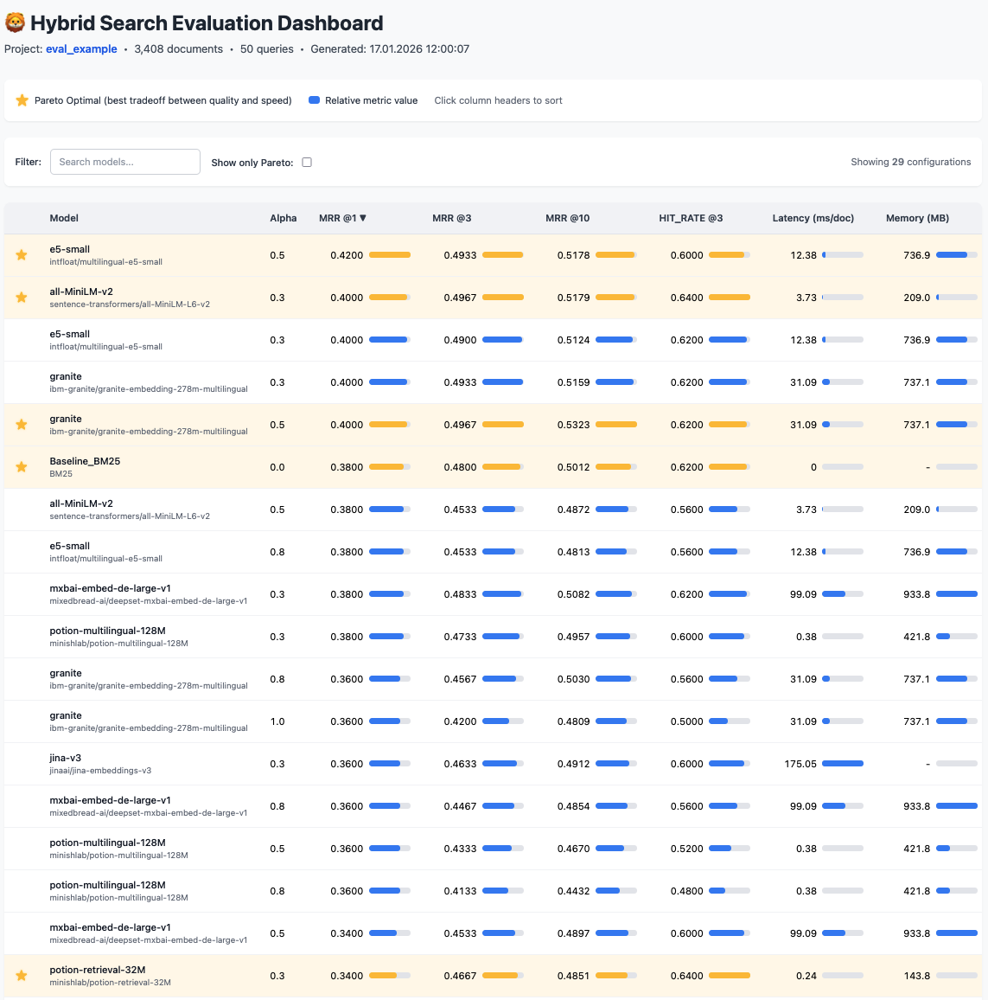

# Hybrid Search Evaluation Tool


[](pyproject.toml)
[](https://github.com/machinelearningZH/hybrid-search-eval/stargazers)
[](https://github.com/machinelearningZH/hybrid-search-eval/issues)
[](https://github.com/machinelearningZH/hybrid-search-eval/pulls)
[](https://github.com/machinelearningZH/hybrid-search-eval)
<a href="https://github.com/astral-sh/ruff"></a>

Benchmark embedding models for hybrid retrieval with BM25 and vector search. The
tool evaluates local Sentence Transformers, OpenRouter embedding models, and
ColBERT late-interaction models against an [MTEB 2.x](https://github.com/embeddings-benchmark/mteb)
retrieval dataset using Weaviate.

It reports MRR@K and Hit Rate@K for evaluated model/alpha pairs, with
corpus-embedding latency and process-memory estimates where available.



## Install

Install [uv](https://docs.astral.sh/uv/getting-started/installation/), then clone
the project and create its Python 3.12 environment. Run commands from the
repository root:

```bash
git clone https://github.com/machinelearningZH/hybrid-search-eval.git
cd hybrid-search-eval
uv sync --locked
```

The default environment uses Sentence Transformers 6.x and Transformers 5.19.0
without PyLate. Transformers 5.19.0 adds EmbeddingGemma 2 support; its exact pin
has an approved fixed-date exception to the seven-day dependency cooldown.
Other packages retain the cooldown. To evaluate ColBERT models, switch to the
optional PyLate profile (Sentence
Transformers 5.3.x):

```bash
uv sync --locked --no-group embeddings --group colbert
uv run --locked --no-group embeddings --group colbert generate_evals.py
```

Use the same group flags for subsequent commands in that profile. Return to
Sentence Transformers 6.x with `uv sync --locked` and ordinary `uv run` commands.
The two profiles cannot be enabled together. Model selection remains in
`_configs/config.yaml`; enable `embeddings.colbert` only with the ColBERT profile.

The [Makefile](Makefile) provides shortcuts; run `make help` for all commands:

```bash
make sync
make eval
make eval PROFILE=colbert
make eval-force CONFIG=_configs/config.yaml
make test ARGS="-q"
make check
make queries INPUT=my_documents.csv ARGS="--provider ollama --num-queries 5"
make download DATASET=mteb/scifact ARGS="--sample 100"
```

Pass `PROFILE=colbert` to each Make command when using PyLate. `make check`
checks formatting, lint, and tests in sequence, stopping on the first failure;
`make format` applies safe Ruff lint fixes, then formats Python files even if
some lint issues require manual fixes. Use `make lint` to check remaining issues.
`ARGS` accepts shell command-line arguments.

## Quick start

The repository includes a small MTEB-format example dataset. Review
[`_configs/config.yaml`](_configs/config.yaml), then run:

```bash
uv run generate_evals.py
```

Results are written to `_results/`; embeddings and evaluation results are cached
in `_cache_embeddings/` and `_cache_evals/`.

A minimal configuration for the included dataset is:

```yaml
project_id: "my-evaluation"

data:
  mteb_data_dir: "./_data/mteb_user"

embeddings:
  huggingface:
    all-minilm: sentence-transformers/all-MiniLM-L6-v2
    e5-small:
      model: intfloat/multilingual-e5-small
      use_query_prefix: true
      use_passage_prefix: true
  device: "auto" # cpu, cuda, mps, or auto

search:
  alpha: [0.5, 1.0] # 0.0 = BM25, 1.0 = vector search
  metrics:
    mrr_k: [10]
    hit_rate_k: [10]
  include_bm25_baseline: true

model:
  embedding_batch_size: 32
  max_document_tokens: 512

output:
  results_dir: "./_results"

visualization: {}
```

Use a separate configuration with `--config PATH`, and pass
`--force-recompute` after changing the data or a material retrieval or embedding
setting.

## Prepare a dataset

### Generate queries from your documents

`generate_queries.py` accepts CSV or Parquet input with a required `text` column
and an optional `id` column. It creates `corpus.parquet`, `queries.parquet`, and
`qrels.parquet` in MTEB format.

For OpenRouter, create a `.env` file with `OPENROUTER_API_KEY`, then run:

```bash
uv run generate_queries.py my_documents.csv
uv run generate_queries.py corpus.parquet --num-queries 5 --output-dir _data/my_dataset
```

With Ollama installed and running, use a local model:

```bash
ollama pull llama3.2:latest
uv run generate_queries.py my_documents.csv --provider ollama --model llama3.2:latest
```

`--max-workers` and `--model` override provider-specific configuration values.
For Ollama, `--ollama-url` sets the endpoint; the current CLI does not read
`query_generation.ollama.url` from YAML.

To generate a new query/qrels set from an existing MTEB corpus, use:

```bash
uv run generate_queries.py ignored --mteb-input-dir _data/mteb/scifact --num-queries 5 --output-dir _data/my_dataset
```

This reads all three input Parquet files and validates the existing dataset.
It replaces the files in the output directory; it does not append to existing
queries or qrels. The default output directory is `_data/mteb_user`.

### Download an MTEB dataset

```bash
uv run download_mteb_datasets.py mteb/scifact
uv run download_mteb_datasets.py mteb/scifact --sample 100 --seed 42
uv run download_mteb_datasets.py mteb/XMarket --language de --split test
```

Downloads are stored in `_data/mteb/` by default and include a
`dataset_manifest.json` with the source revision, selected split/language, and
sampling details. Select `--language` or `--split` explicitly when repository
metadata is ambiguous. Dataset names, language codes, and splits in these
examples depend on upstream availability; they are not verified by local tests.

`--sample` uses seeded, query-led sampling and can retain more than the requested
number of documents to preserve positive judgments. With `--sample`, use
`--query-sample N` to select up to N available queries first. The manifest records
the supplied revision (default: `main`), not a resolved immutable commit; use
`--revision` to request a specific revision.

To inspect available retrieval datasets:

```bash
uv run list_retrieval_datasets.py --benchmark "MTEB(eng, v2)"
uv run list_retrieval_datasets.py --benchmark "MTEB(de)" --format csv --out retrieval_datasets.csv
```

### Required MTEB files

Set `data.mteb_data_dir` to a directory containing these files:

| File | Required columns |
| --- | --- |
| `corpus.parquet` | `id`, `text`; optional `title` |
| `queries.parquet` | `id`, `text` |
| `qrels.parquet` | `query-id`, `corpus-id`; optional `score` (defaults to 1) |

Tables must be nonempty. Corpus/query IDs must be unique after string
normalization, text must contain strings, qrels must reference existing IDs,
and every query must have a positive judgment. Scores must be finite numbers;
only `score > 0` counts as relevant. Avoid duplicate query/document judgment
pairs: the current loader keeps the last score for each pair.

## Models and search modes

Model IDs in the configuration and examples are not compatibility guarantees;
the local tests do not download models or verify provider availability.

- Configure Sentence Transformers under `embeddings.huggingface`. A model entry
  can be a model ID or a mapping with `model`, prefix options
  (`use_query_prefix`, `use_passage_prefix`), prompt options
  (`use_query_prompt`, `use_passage_prompt`), or explicit
  `query_prompt_name` / `passage_prompt_name`. Explicit prompt names take
  precedence over the corresponding prompt flags. These options apply only to
  the Sentence Transformers backend.
- Configure OpenRouter models under `embeddings.openrouter.models`; they require
  `OPENROUTER_API_KEY` in `.env`. See the
  [available embedding models](https://openrouter.ai/models?fmt=cards&output_modalities=embeddings).
- Configure ColBERT models under `embeddings.colbert`. They use token-level
  MaxSim scores; mixed alpha values combine those scores with BM25.

> [!IMPORTANT]
> Document text is truncated using `cl100k_base` to `model.max_document_tokens`
> (512 by default) before both BM25 indexing and embedding. Prefixes are added
> afterward, and models may truncate again with their own tokenizers. Titles and
> extra query fields are not used for retrieval.

> [!CAUTION]
> Local Sentence Transformers and ColBERT models use `trust_remote_code=True` to
> support custom architectures. Evaluate the trustworthiness of every model
> repository before using it. Use only trusted embedding caches: the current
> ColBERT loader permits pickled NumPy arrays.

## Outputs and interpretation

Runs with results write a CSV, metric charts, and an interactive HTML dashboard.
Embedding results also produce embedding-time and quality-versus-embedding-latency
charts; a memory chart requires recorded memory data. The dashboard embeds its
result data but loads Tailwind CSS from a CDN, so styled viewing needs network
access.

- **MRR@K** averages the reciprocal rank of the first relevant result within K,
  using zero for misses.
- **Hit Rate@K** is the share of queries with at least one relevant result in the
  top K.
- **Latency** is corpus embedding time only; it excludes model loading, query
  embedding, indexing, retrieval, and reranking. For OpenRouter it includes the
  embedding request and network time. Cache hits reuse the recorded timing.
- **Memory** is a sampled process-RSS delta. It is not a peak measurement and
  excludes accelerator memory.
- **Pareto flags** compare one quality metric with document-embedding latency.
  `visualization.pareto_quality_metric` selects that metric; otherwise the highest
  MRR cutoff is used, falling back to the highest Hit Rate cutoff. Memory is not
  part of the comparison, and BM25 is unclassified. Charts and the dashboard use
  the same calculation.

Treat results as evidence for the configured experiment, not universal model
rankings. In particular:

- LLM-generated queries and qrels primarily test recovery of the source document;
  they can miss other relevant documents and do not represent production traffic.
- MRR and Hit Rate use binary relevance and do not measure recall or graded
  relevance. Preserve per-query results and assess uncertainty before relying on
  small differences.
- ColBERT MaxSim is computed exhaustively across the corpus, without a candidate
  retrieval stage. This does not measure production retrieval throughput. Its
  min-max score fusion differs from Weaviate hybrid fusion at the same alpha;
  `search.bm25_candidate_limit` affects only the ColBERT mixed-alpha path.
- Cache keys do not include dataset contents, row order, truncation limits, model
  revisions, or every retrieval setting. Recompute after any relevant change and
  compare runs only when their inputs and environment match.
- Query generation saves final Parquet files but not raw responses, provider
  revisions, or a failure manifest. Preserve those separately when auditability
  matters. API failures can leave fewer queries than requested, and query IDs
  follow worker completion order. The parser also strips leading digits and
  punctuation, which can alter valid queries such as `3D printing`.
- The evaluation CLI returns normally for some validation/startup failures and
  can announce completion after skipping models or writing an empty CSV. Inspect
  console errors and result rows; its exit status alone does not establish success.

## Project structure

| Path | Purpose |
| --- | --- |
| `generate_evals.py` | Evaluation pipeline |
| `generate_queries.py` | LLM query generation |
| `download_mteb_datasets.py` | MTEB dataset download and sampling |
| `list_retrieval_datasets.py` | MTEB retrieval-dataset discovery |
| `_configs/config.yaml` | Default configuration |
| `_core/utils.py` | Shared data/config validation, caches, metrics, and reporting |
| `_core/dashboard_template.html` | HTML dashboard template |
| `_core/utils_prompts.py` | Query-generation prompts |
| `_data/` | MTEB datasets and user data |
| `tests/` | Local unit tests and boundary fakes |
| `Makefile` | Environment, evaluation, data, and quality commands |
| `NOTES.md` | Implementation constraints and operational notes |

## Contributing

Feedback and contributions are welcome: [email the team](mailto:datashop@statistik.zh.ch),
open an issue, or submit a pull request. The project uses
[Ruff](https://docs.astral.sh/ruff/) for linting and formatting.

## License

This project is licensed under the MIT License. See [LICENSE](LICENSE).

## Disclaimer

This evaluation tool (the Software) evaluates user-defined open-source and
closed-source embedding models (the Models). You are solely responsible for
ensuring that your use of the Software as well as of the underlying Models
complies with all applicable local, national and international laws and
regulations. By using this Software, you acknowledge and agree (a) that it is
your responsibility to assess which laws and regulations, in particular regarding
the use of AI technologies, are applicable to your intended use and to comply
therewith, and (b) that you will hold us harmless from any action, claims,
liability or loss in respect of your use of the Software.
